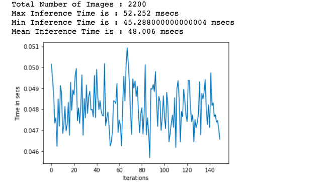
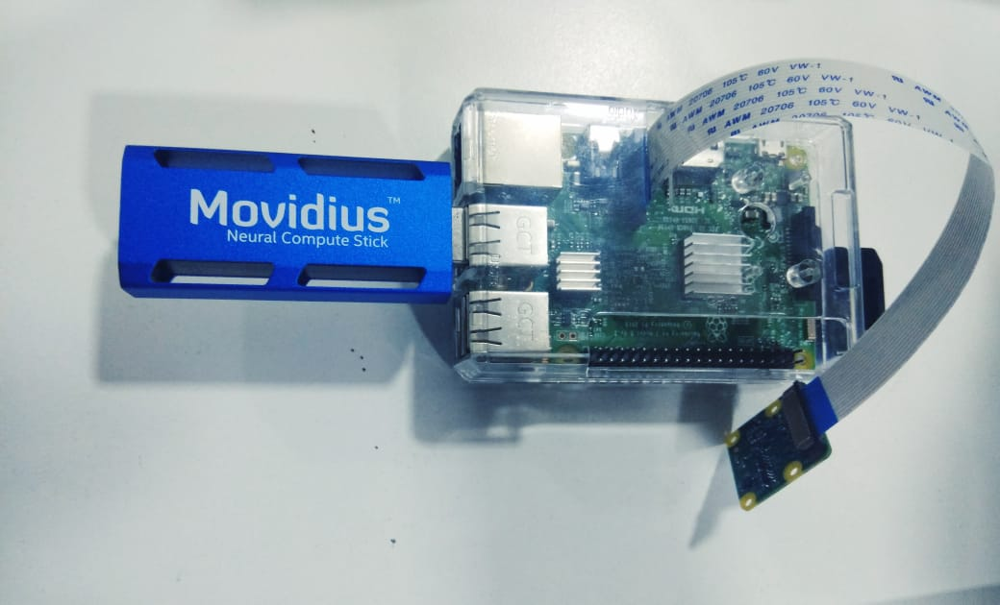

# stanford_cars_dataset
This is the submission for the [Grab Computer Vision Challenge](https://www.aiforsea.com/computer-vision).

## Thought Process
It is very easy to create neural networks that can get a good accuracy on a dataset. However, most of those neural networks cannot be used in real time to perform predictions. Maybe the models are take a lot of time to perform a prediction, or maybe they are so big that they need powerful machines to run them, or maybe there is so much feature engineering and preprocessing that the model becomes very hard to scale.

It is because of this that models need to be small and fast, but still make good predictions. This was the motivation behind this submission: Can we make a model that is fast and scalable, but also robust and accurate. To do this, we used concepts of Edge Computing.

## Edge Computing
<br/>

Machine Learning Models have been primarly dependent on the cloud for data storage and analysis. As the Internet of Things (IoT) and autonomous driving becomes more mainstream, the number of devices connected to the web is increasing by the millions. In fact, Forbes estimates that the number of Internet-connected devices will exceed 75 Billion by 2025. Many, if not most, of these devices, will be smart.

There are a lot of very compelling reasons for shifting computations away from the cloud and into the edge, with the most important being latency issues. Here, latency refers to the time it might take to send data to a server and then receive the response. The few seconds of delay caused by this might not be a problem for your smart home applications, but commercially, those few precious seconds, or even microseconds, can cause a machine to break down or a fatal accident.

If you have many sensors, you will probably be streaming data in the order of giga bytes every hour. Even a simple camera like a pi cam will generate nearly 50 GB of data per hour at a resolution of 1280×720 and 30 fps5. It does not make sense for companies to pay for the bandwidth to send that much data when most of it is discarded anyway. Hence, it is crucial to shift all that computation to where the data is getting generated.

In this Grab AI for SEA challenge of Computer Vision, the world of edge computing brings us closer to better model performance and buisness solution in approaching real-world problems. 

## What was done
For this work, multiple types of models were trained using transfer learning. A total of 8 models were trained: **inception_resnet, inception, mobilenet, resnet, vgg16, vgg19, xception**.

Each of these models have their own advantages and disadvantages. You can see a comparision of that in the [ipynb notebook](benchmark_vis.ipynb). The different models were trained and they were compared to see which is best based on their f1 scores and time taken to perform inference.

### Installation
The repo requires python3.6. To install the packages required, use:

```bash
pip install -r requirements.txt
```

### Training a model
The `train_model.py` file can be used to train the individual models.

The following arguments are used the train the models:
- model_type: Which model to use. One of `inception_resnet`, `inception`, `mobilenet`, `resnet`, `vgg16`, `vgg19`, `xception`. Default = inception_resnet
- nb_epoch: Number of epochs for Transfer Learning. Default = 1.
- batch_size: Batch size for training. Default = 32.
- model: Path to save model to
- ft: Use this flag if you want to fine tune your model too.
- epoch_ft: The number of epochs to finetune the model for. Default = 1
- model_ft: Path to save finetuned model to.

**Note**: Normal training will just train the last feedforward network of the model and freeze the convolutional layers. Finetuning will unfreeze the initial convolutional layers and train the whole network.

Sample command to train the model is:
```bash
python train_model.py --model_type inception --nb_epoch 1 --model models/inception.h5 --ft --model_ft models/inception_ft.h5 --epoch_ft 2 --nb_epoch 2
```

### Inference
To run inference on the model you can use the `benchmark_and_test.py` file.

The following arguments are used to run inference:
- loc: The path where you want to save the prediction results
- model: The path of the saved model file. The model which you want to use for running inference
- model_type: Which model you are running inference with. One of `inception_resnet`, `inception`, `mobilenet`, `resnet`, `vgg16`, `vgg19`, `xception`.
- gpu: This is a flag that you can use to use GPU. By default predictions run on CPU
- multi: This is a flag that you can use if you want to use multiple GPUs to run inference.
- images: Folder that contains the images you want to use to run inference.

Sample command to perform inference:
```bash
python benchmark_and_test.py --loc benchmarks/inception --model_type inception --model models/inception.h5 --images data/test/1
```
### Benchmark
The `benchmark_and_test.py` can also be used to run benchmarking of the trained model.

Along with the arguments above, you can use the following for benchmarking:
- benchmark: A flag to run the script in benchmark mode
- i: During benchmarking you might want to run the model for a long time to see how it performs over a long period of time. This key will iterate over the same images i number of times

Sample command for benchmarking:
```bash
 python benchmark_and_test.py --loc benchmarks/inception --model_type inception --model models/inception.h5 --images data/test/1 --i 100 --benchmark
```

#### Time taken for Inference

One of the major factor in determining efficient models for running on the edge, is to calculate the time taken for the model to run inference.
You might want to run different models to compare like VGG, MobileNet, ResNet. <br/>

Mobile Net performs the best giving around 48 msec in average for inference. 



### Model Architecture 

Please check the ["model.png"](https://github.com/varchanaiyer/stanford_cars_dataset/blob/master/model.png) file for the extensive architecture used for this challenge


### Raspberry Pi 

<br/>

Raspberry Pi is a small and affordable mini computer without any peripherals. It also has an ARM Compatible CPU with an onboard GPU card . The Raspberry Pi has Wifi and Bluetooth capabilities with an operating system which supports both Linux and Raspbian.Due to its good and large open source community, it is often used by developers across the world. It can be used to run efficient machine learning models on the device.  
